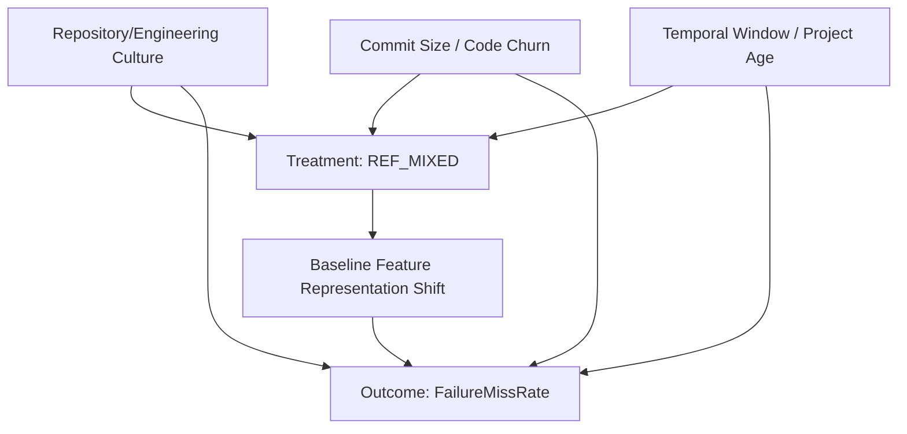

# Phase 14: Identification DAG & Adjustment Strategy (E11)

## 1. Causal DAG for RQ1
To estimate the causal effect of `REF_MIXED` (Treatment, $T$) on `FailureMissRate` (Outcome, $Y$), we must control for confounders ($C$) that influence both the likelihood of a developer performing a refactoring and the historical performance of the PTS model.

## 2. Identified Confounders
* **Repository**: Different projects have different refactoring habits, test suite designs, and base failure rates.
* **Commit Size**: Large commits are more likely to contain refactorings and inherently carry a higher risk of introducing bugs that a PTS model might struggle to capture.
* **Temporal Window**: Older projects have richer histories, which benefits the PTS baseline but may also accumulate more structural decay prompting refactoring.

## 3. Primary Adjustment Strategy
We will employ a **Hierarchical (Mixed-Effects) Logistic Regression**.
* **Fixed Effects**: Treatment (`REF_MIXED`), Commit Size (log-transformed lines of code churn), Temporal Window (days since first commit).
* **Random Effects**: A random intercept for `Repository` to cluster test executions within commits within repositories.
* **Why**: This strategy models the hierarchical structure of the CIBench data, preventing Simpson's Paradox (where high-failure-rate repositories dominating the dataset skew the average effect). 

## 4. Sensitivity Analysis
* **Propensity Score Matching (PSM)**: Within each repository, match every `REF_MIXED` commit to a `NON_REF` commit with the closest total code churn and temporal age, then evaluate the ATE on the matched sample to test the robustness of the primary regression model.
