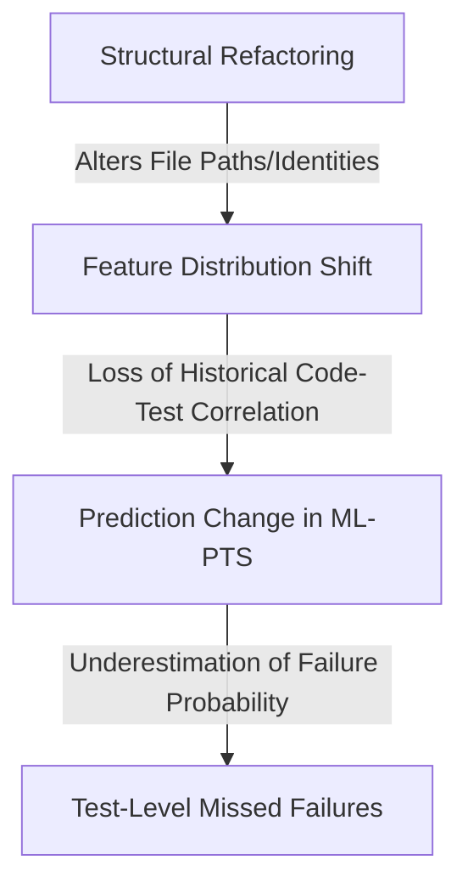

# Phase 12B: Research Design for E11

## 1. Final Research Problem
Machine-learning-based Predictive Test Selection (PTS) models often rely on historical file-path change frequencies and code-test co-occurrence matrices. When structural refactorings (such as class renames, method moves, or cross-module relocations) occur, these historical file identities are altered or destroyed. It is unknown to what extent this identity loss induces a feature distribution shift that limits the model's ability to capture historical failure correlations, and whether this shift increases the probability of silently skipping necessary tests (missed regressions).

## 2. Research Questions (RQ1–RQ3)
* **RQ1:** Do structural refactoring commits exhibit different test-level missed-failure behavior in history-based ML-PTS models compared to standard feature commits?
* **RQ2:** Which specific categories of structural refactoring (e.g., class renames, method moves, cross-module extractions) are most strongly associated with differences in PTS false negatives?
* **RQ3:** To what extent is the refactoring-associated change in PTS performance attenuated when historical code identity is preserved through structural mapping?

## 3. Conceptual Model

## 4. Refactoring Taxonomy
Based strictly on the detectable operations of the RefactoringMiner 2.0 tool:
1. **Rename Operations**: Rename Class, Rename Method, Rename Variable/Parameter.
2. **Relocation Operations**: Move Method, Move Class, Move Attribute (across files).
3. **Extraction/Inlining Operations**: Extract Method, Inline Method, Extract Class, Inline Class.
4. **Type Changes**: Change Variable Type, Change Return Type, Change Parameter Type.

## 5. Population Definition
The population comprises history-based tabular ML-PTS models using the specified feature family, evaluated on the Continuous Integration (CI) build histories of mature, open-source Java repositories.

## 6. Repository Inclusion Criteria
* Mature, open-source Java projects.
* >5 years of continuous version control history.
* >5,000 total commits.
* >1,000 automated unit tests.
* Available continuous CI build logs with pass/fail histories for individual tests.
* Sufficient historically failing CI builds to allow for robust ML evaluation.

## 7. Repository Exclusion Criteria
* Projects written primarily in languages other than Java.
* Projects lacking an automated CI test suite.

## 8. CI-Build Inclusion Criteria
* Commits triggered by pull requests or pushed to the main branch.
* Commits that successfully compiled (no syntax/build errors) and proceeded to test execution.
* Commits that produced a parsable XML/JSON test report containing individual test outcomes.

## 9. Handling Rules for Edge Cases
* **flaky tests**: Tests that fail and pass on the exact same commit hash (if repeated runs exist), or exhibit random toggling across consecutive identical branches, are explicitly excluded.
* **merge commits**: Excluded. Their diffs and test failures conflate changes from multiple branches.
* **infrastructure failures**: Builds failing due to Maven/Gradle timeout, OOM, or external service unavailability are excluded.
* **test-only commits**: Excluded from the feature vs. refactoring comparison, as they do not modify production code ASTs.
* **mixed commits**: Processed and evaluated separately from candidate pure-refactoring commits to prevent confounding.
* **reverted commits**: Kept in strictly chronological order. They represent real developer workflows and CI events.
* **duplicated builds**: For a single commit hash, only the first chronologically completed build is included.

## 10. ML-PTS Baseline Definition
The study defines its baseline explicitly as a **history-based tabular ML-PTS model using the specified feature family** (e.g., file paths, historical failure rates, code churn). It does *not* claim to represent every industrial PTS system (e.g., proprietary systems utilizing deep semantic embeddings or deterministic graphs).

## 11. Selection Threshold (Operating-Point Procedure)
Arbitrary probability thresholds will not be used. The threshold will be set via an operating-point procedure:
* **TRAIN**: Fit the model.
* **VALIDATION**: Select the test execution probability threshold according to a predefined selection budget or test-time reduction target (e.g., 50% time saved).
* **TEST**: Freeze the threshold and evaluate once. No threshold tuning is permitted on the test set.

## 12. Experimental Comparisons
* **Baseline PTS on Feature Commits** vs. **Baseline PTS on Candidate Pure-Refactoring Commits** (Tests RQ1).
* **Baseline PTS on specific Refactoring Categories** (Tests RQ2).
* **Baseline PTS** vs. **Identity-Aware PTS** (incorporating historical file identity mapping, moved-code mapping, or structural indicators) on Refactoring Commits (Tests RQ3).

## 13. Statistical Analysis Plan
The exact statistical tests will not be finalized until a dataset census has established failure prevalence, refactoring commit counts, repeated-test structure, and class imbalance. However, the analysis will account for the data hierarchy (test $\rightarrow$ commit $\rightarrow$ repository) using appropriate clustering or mixed-effects models (e.g., repository random effects). 

## 14. Data Power & Census Requirement
Statistical power strictly depends on the conjunction of three factors: the number of pure refactoring commits, the number of actual failing tests, AND the number of missed failing tests. A dataset census must be conducted prior to the full study to guarantee sufficient sample sizes in these overlapping strata.

## 15. Falsification Criteria
The central hypothesis is falsified if the test-level miss behavior for refactoring commits is statistically indistinguishable from, or lower than, that of feature commits, or if the distribution shift is negligible.

## 16. What result makes the question scientifically interesting even if H1 is false?
If structural refactoring does not alter the PTS test-level miss behavior, it implies that these tabular ML PTS models are highly robust to code-identity destruction. This would suggest that simple code churn features or unmodified surrounding contexts provide sufficient predictive signal, making complex AST-mapping extensions unnecessary. This robustness would be a major empirical finding.
